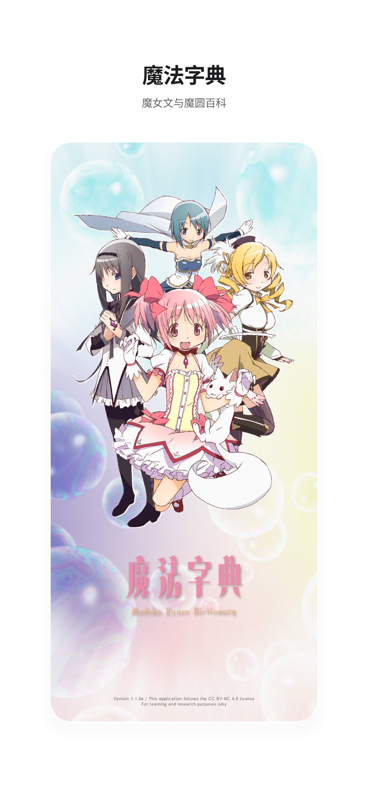
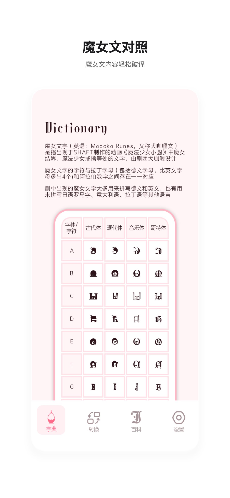
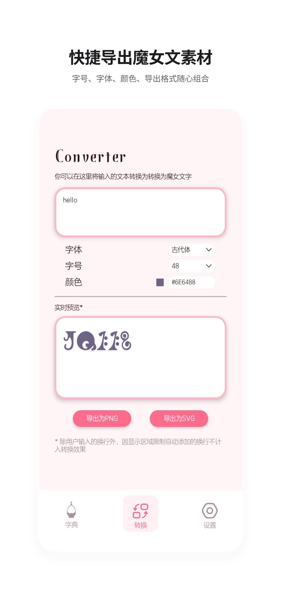

# MadoRunes Offline (魔女文字典与转换器)

  

  一个基于Jetpack Compose开发的纯离线《魔法少女小圆》魔女文（Madoka Runes）对照字典、实时转换和离线维基查询工具。

---

##  简介

**魔法字典** 是一款向《魔法少女小圆》致敬的同人衍生Android应用。本应用数据及字体完全离线化，旨在为粉丝、考据党及二次创作者提供一个丝滑、纯净的魔女文字符对照、文本转换与词条查询工具。

本应用参照原版Web端设计：[madorunes.cn](https://www.madorunes.cn) | 仓库链接：[Madoka-Runes](https://github.com/BlackCoder0/Madoka-Runes)

字体资源来源于[somlibaria](https://tieba.baidu.com/home/main?fr=pb&id=tb.1.df458a65.pThF7AVtjtVtywlkzrvvHg%3Ft%3D1586141278)

---

##  特性

- **四大字体**：完整收录古代体（大写）、现代体（小写）、音乐体、哥特体，支持多字体就地离线渲染。
- **实时转换**：输入英文/数字即可动态生成魔女文，支持一键导出为图形文件。
- **离线维基**：随着应用的不断维护和更新，自带的离线维基条目将会逐渐完善，以至于可以满足魔圆系列常用词条的查询。
- **双主题切换**：
  - **浅色模式（鹿目圆）**：柔和樱粉与治愈纯白。
  - **深色模式（晓美焰）**：深邃紫黑与冷冽银灰。
- **多语言支持**：UI支持简体中文、English、日本語。

---

## 预览

      

 ---

## 安装

 于Release页面下载意向版本的安装包即可

 最低系统版本： Android 8.1
 
 推荐系统版本： Android 13或以上

 ## 后期维护方向
 
 尽力确保每周新增7个词条，一周发布一个新版本
